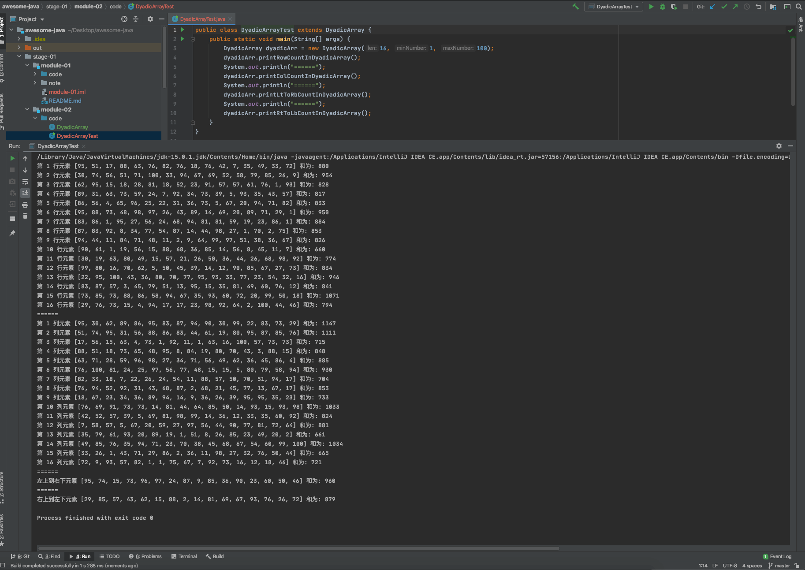

# Java 面向对象编程

## 笔记

- [x] 任务一：[类和对象](./note/note-01.md)
- [x] 任务二：[方法和封装](./note/note-02.md)
- [x] 任务三：[static关键字和继承](./note/note-03.md)
- [ ] 任务四：[多态和特殊类](./note/note-04.md)
- [ ] 任务五：[特殊类](./note/note-05.md)

## 作业
编程实现以下需求

1. 定义一个长度为\[16\]\[16\]的整型二维数组

（1）随机生成所有位置的元素值(1\~100)

（2）分别实现二维数组每行元素的累加和及每列元素的累加和并打印。

（3）再分别实现二维数组中左上角到右下角和右上角到左下角所有元素的累加和并打印。

答案：[二维数组打印](./code/DyadicArray.java)



2. 编程实现控制台版并支持两人对战的五子棋游戏。 

（1）绘制棋盘 - 写一个成员方法实现 

（2）提示黑方和白方分别下棋并重新绘制棋盘 - 写一个成员方法实现。 

（3）每当一方下棋后判断是否获胜 - 写一个成员方法实现。 


```
提示： 采用二维数组来模拟并描述棋盘，棋盘如下： 

  0 1 2 3 4 5 6 7 8 9 a b c d e f
0 + + + + + + + + + + + + + + + +
1 + + + + + + + + + + + + + + + +
2 + + + + + + + + + + + + + + + +
3 + + + + + + + + + + + + + + + +
4 + + + + + + + + + + + + + + + +
5 + + + + + + + + + + + + + + + +
6 + + + + + + + + + + + + + + + +
7 + + + + + + + + + + + + + + + +
8 + + + + + + + + + + + + + + + +
9 + + + + + + + + + + + + + + + +
a + + + + + + + + + + + + + + + +
b + + + + + + + + + + + + + + + +
c + + + + + + + + + + + + + + + +
d + + + + + + + + + + + + + + + +
e + + + + + + + + + + + + + + + +
f + + + + + + + + + + + + + + + +
```


