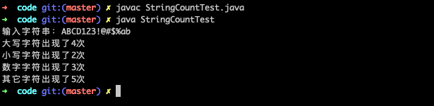

# Java 核心类库（上）

## 笔记

- [x] 任务一：[常用类的概述和使用](./note/note-01.md)
- [x] 任务二：[String方法的概述和使用](./note/note-02.md)
- [x] 任务三：[可变字符串日期相关类](./note/note-03.md)
- [ ] 任务四：[集合类库(上)](./note/note-04.md)
- [ ] 任务五：[集合类库(下)](./note/note-05.md)

## 作业

1. 编程题 

编程统计字符串"ABCD123!@#$%ab"中大写字母、小写字母、数字、其它字符的个数并打印出来。 

答案：[二维数组打印](./code/StringCount.java)



2. 编程题 

准备一个 HashMap 集合，统计字符串"123,456,789,123,456"中每个数字字符串出现的次数并打印出来。 如： 

```
123 出现了 2 次 

456 出现了 2 次 

789 出现了 1 次 
```

答案：[二维数组打印](./code/NumberCount.java)


3. 编程题 

使用集合实现斗地主游戏的部分功能，要求如下： 

（1）首先准备 54 张扑克牌并打乱顺序。 

（2）由三个玩家交替摸牌，每人 17 张扑克牌，最后三张留作底牌。 

（3）查看三个玩家手中的扑克牌和底牌。 

（4）其中玩家手中的扑克牌需要按照大小顺序打印，规则如下： 

手中扑克牌从大到小的摆放顺序：大王,小王,2,A,K,Q,J,10,9,8,7,6,5,4,3


